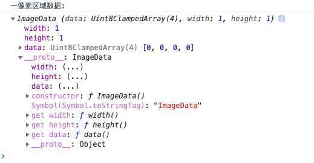

### canvas 1 像素占用多大内存
[参考](https://mp.weixin.qq.com/s/EGgsMBjGCG8l9JViYxvX3g)

#### 纸面分析
1个像素点颜色值是 RGBA(a, b, c, d), abc一般是0-255之间，也就是3个字节，d是0-1之间的数，看步长，步长越小，精度越高，则占用内存越大，canavs里面步数0.01, 7个bit就够表示，不过在计算机计算时，一般以一个字节为单位，所以一个像素应该是(3 + 1 = 4)个字节

#### 实验
canvas有个API是getImageData，返回一个ImageData，表示canvas某区域的隐含像素。
> ImageData 接口描述 <canvas> 元素的一个隐含像素数据的区域

```js
  let imageData = ctx.getImageData(0, 0, 1, 1)
  console.log('一像素区域数据: ')
  console.log(imageData)
```

打印出来的数据是一个长度为4的int8数组


> Uint8ClampedArray 描述了一个一维数组，包含以 RGBA 顺序的数据，数据使用  0 至 255（包含）的整数表示。

#### 参考
[MDN-canavs](https://developer.mozilla.org/zh-CN/docs/Web/API/ImageData)